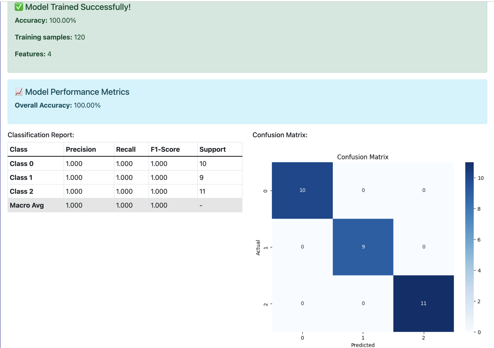
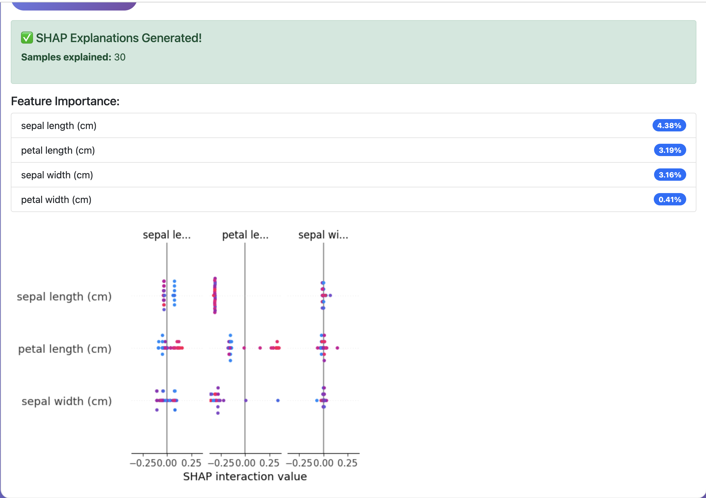
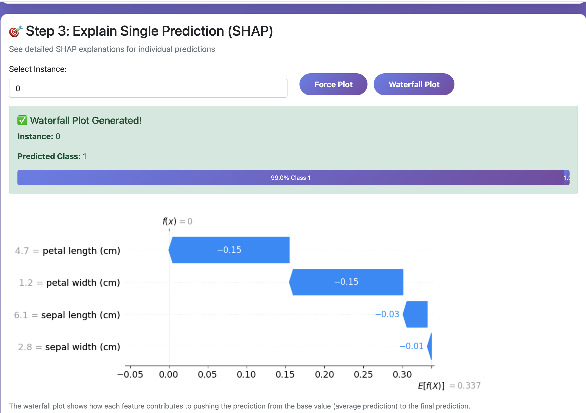

# 🧠 AIML Explainer

> A full-stack machine learning interpretability platform that makes AI predictions understandable for everyone.


---

## 📸 Demo

### Step 1 — Train Model & View Performance


### Step 2 — SHAP Global Feature Importance


### Step 3 — SHAP Waterfall (Single Prediction)


---

## 📖 Overview

AIML Explainer bridges the gap between machine learning models and human understanding.
Users upload any CSV dataset, train a Random Forest classifier, and receive interactive
visual explanations of how the model made each prediction — powered by **SHAP** and **LIME**.

Built as a senior capstone project (SP-105) at Kennesaw State University.

### Key Features
- 📂 Upload any CSV dataset or use the built-in Iris sample
- 🤖 Train a Random Forest classifier in one click
- 📊 Global feature importance via **SHAP** summary plots
- 🔍 Per-instance explanations via **SHAP** force & waterfall plots
- 🍋 Local explanations via **LIME** for comparison
- 📈 Full performance metrics — accuracy, confusion matrix, F1, precision, recall
- 📥 Download analysis report as a text file

---

## 🏗️ Architecture

---

## 🔌 API Endpoints

| Method | Endpoint | Description |
|--------|----------|-------------|
| `GET` | `/` | Main dashboard |
| `GET` | `/health` | Health check |
| `GET` | `/info` | Project info |
| `POST` | `/upload_dataset` | Upload a CSV dataset |
| `POST` | `/train_model` | Train on built-in Iris dataset |
| `POST` | `/train_custom_model` | Train on uploaded dataset |
| `POST` | `/get_performance_metrics` | Confusion matrix + classification report |
| `POST` | `/generate_shap` | SHAP global summary plot |
| `POST` | `/explain_instance` | SHAP force plot for one instance |
| `POST` | `/generate_waterfall` | SHAP waterfall plot for one instance |
| `POST` | `/generate_lime` | LIME global feature importance |
| `POST` | `/explain_instance_lime` | LIME explanation for one instance |
| `POST` | `/download_results` | Download analysis report |

---

## ⚙️ Getting Started

### Prerequisites
- Python 3.9+
- pip

### Installation

```bash
# 1. Clone the repo
git clone https://github.com/Gloria-Naomi/aiml-explainer-backend.git
cd aiml-explainer-backend

# 2. Create and activate virtual environment
python3 -m venv venv
source venv/bin/activate      # Windows: venv\Scripts\activate

# 3. Install dependencies
pip install -r requirements.txt

# 4. Set up environment variables
cp .env.example .env          # Edit as needed

# 5. Run the app
python3 run.py
```

Open your browser at `http://localhost:8080`

---

## 📁 Project Structure

---

## 🧠 Tech Decisions

| Choice | Why |
|--------|-----|
| Flask app factory pattern | Supports multiple environments (dev/prod/test) cleanly |
| Layered architecture (routes → services → models) | Separation of concerns; easier to test and extend |
| SHAP + LIME together | SHAP = global feature importance; LIME = local per-prediction |
| SQLite | Zero-config, portable — appropriate for this project scale |
| Random Forest | Robust baseline classifier; compatible with TreeExplainer for fast SHAP |
| Environment configs | Dev/Prod/Testing configs via `config.py` for production readiness |

---

## 🔮 Future Improvements

- [ ] Deploy on AWS EC2 with Docker
- [ ] Add user authentication (JWT)
- [ ] Support regression models
- [ ] Export explanations as PDF
- [ ] Add support for more classifiers (XGBoost, SVM)

---

## 👩🏾‍💻 Author

**Gloria Kouam** — [LinkedIn](https://linkedin.com/in/gloriakouam) · [GitHub](https://github.com/Gloria-Naomi)

*Kennesaw State University — Computer Science, Class of 2025*